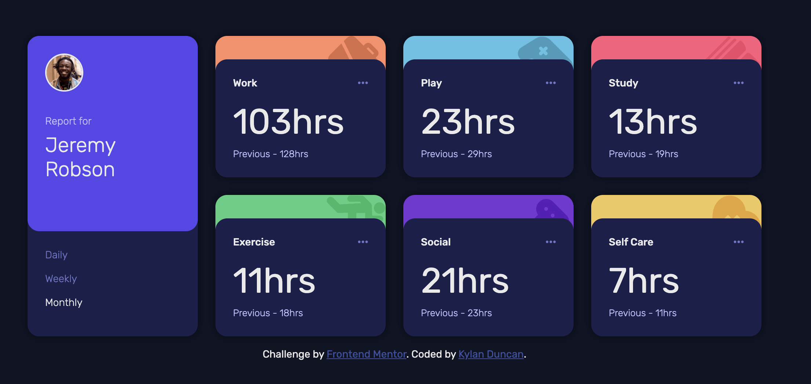

# Frontend Mentor - Time tracking dashboard solution

This is a solution to the [Time tracking dashboard challenge on Frontend Mentor](https://www.frontendmentor.io/challenges/time-tracking-dashboard-UIQ7167Jw). Frontend Mentor challenges help you improve your coding skills by building realistic projects. 

## Table of contents

- [Overview](#overview)
  - [The challenge](#the-challenge)
  - [Screenshot](#screenshot)
  - [Links](#links)
- [My process](#my-process)
  - [Built with](#built-with)
  - [What I learned](#what-i-learned)
  - [Continued development](#continued-development)
- [Author](#author)

## Overview

### The challenge

Users should be able to:

- View the optimal layout for the site depending on their device's screen size
- See hover states for all interactive elements on the page
- Switch between viewing Daily, Weekly, and Monthly stats

### Screenshot

### Links

- Solution URL: [Add solution URL here](https://your-solution-url.com)
- Live Site URL: [Add live site URL here](https://your-live-site-url.com)

## My process

### Built with

- Semantic HTML5 markup
- CSS custom properties
- Flexbox
- CSS Grid
- Desktop-first workflow

### What I learned

I reinforced my existing knowledge about grid-box with this project, which, surprisingly, turned out to be the easiest part. What was a bit tricker was adding the typing animation whenever a timeframe button was pressed. Whenever I was first watching tutorials about HTML/CSS/JS, they used the concept of namespaces for declaring elements and editing elements using the text node, and using those concepts turned out to be beneficial when creating the typing animation. I'm gonna try to incorporate it more in my future frontend projects.

Use this section to recap over some of your major learnings while working through this project. Writing these out and providing code samples of areas you want to highlight is a great way to reinforce your own knowledge.

### Continued development

If I were to continue, I would:
- add functionality to edit the image and name of the profile
- add functionality to be able to pull `.json` files from the internet to use for the timecards
- add functionality to be able to add more timecards for more categories

## Author

- Website - [Kylan Duncan](https://www.cloudydaiyz.com)
- Frontend Mentor - [@cloudydaiyz](https://www.frontendmentor.io/profile/cloudydaiyz)